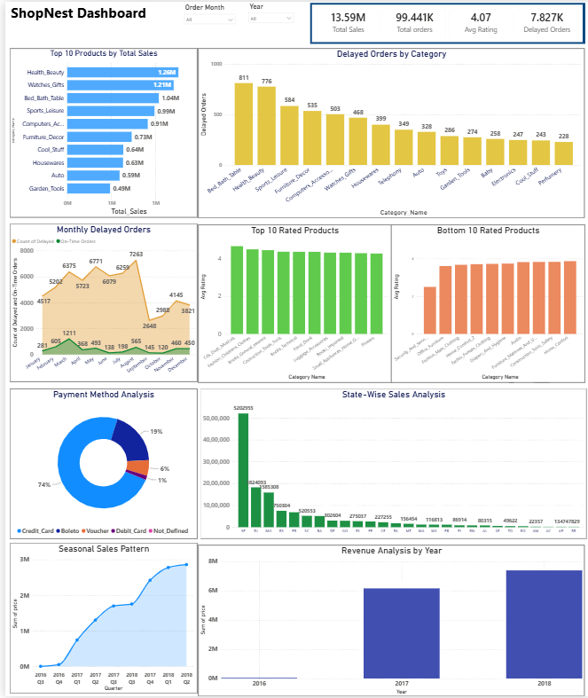

# 🛒 ShopNest Store — Power BI Capstone Project

## 📌 Project Overview
ShopNest is the leading department store in the e-commerce 
marketplace in Portugal. It connects small businesses from 
various regions to customers through a single platform, with 
logistics handled by ShopNest delivery partners.

This Power BI capstone project answers 8 business analytics 
questions using 9 real datasets covering orders, customers, 
products, payments, reviews, geolocation and sellers. The 
dashboard is built on a single page with all 8 visualisations, 
interactive slicers and drillthrough functionality.

---

## 📸 Dashboard Preview


## 📄 Project Report
[Click here to view the full report](ShopNestReport.pdf)

---

## 📊 Project Summary

| Metric | Value |
|--------|-------|
| Dataset Period | September 2016 – October 2018 |
| Total Orders | 99,441 unique orders |
| Total Revenue | $13.59M |
| Delayed Orders | 7,827 orders (8.1%) |
| Avg Review Score | 4.07 out of 5.0 |
| Top State | São Paulo — $5,202,955 |
| Top Category | Health & Beauty — $1.26M |
| Total Datasets | 9 datasets |
| Analytics Tasks | 8 business questions answered |

---

## 📁 Datasets Used

| Dataset | Description |
|---------|-------------|
| orders | Order ID, purchase date, delivery dates, status |
| order_items | Product ID, price, freight value per order |
| products | Product name, category, dimensions |
| customers | Customer ID, city, state, zip code |
| payments | Payment type, instalment count, value |
| reviews | Review score, comment, review date |
| sellers | Seller ID, city, state |
| geolocation | Zip code, latitude, longitude |
| product_category | Category name translation |

---

## 📋 8 Business Analytics Tasks

### Task 1 — Top 10 Categories by Total Sales
- **Visual:** Horizontal Bar Chart with Top N filter
- **Finding:** Health & Beauty leads with $1,258,981
- **Top 3:** Health & Beauty → Watches & Gifts → Bed Bath Table

### Task 2 — Delayed Orders by Category
- **Visual:** Horizontal Bar Chart — top 10 delayed categories
- **Finding:** 7,827 orders delayed out of 96,476 delivered
- **Delay Rate:** 8.1% overall
- **Most Delayed:** Bed Bath Table (811) → Health & Beauty (776)

### Task 3 — Monthly Delayed vs On-Time Orders
- **Visual:** Stacked Bar Chart + Drillthrough to detail page
- **Finding:** August has peak delayed orders (7,263)
- **Best Month:** September has lowest delays (2,648)
- **Feature:** Drillthrough to order-level detail for each month

### Task 4 — Payment Method Analysis
- **Visual:** Donut Chart with segment labels
- **Finding:** Credit Card dominates at 73% (76,795 orders)
- **Top 2:** Credit Card + Boleto = 92% of all transactions

### Task 5 — Product Rating Analysis
- **Visual:** Two Column Charts — Top 10 and Bottom 10
- **Finding:** Overall average rating is 4.07 out of 5.0
- **Top rated:** CDs DVDs Musicals (4.2 – 4.6)
- **Lowest rated:** Security & Services (2.5)

### Task 6 — State-wise Sales Analysis
- **Visual:** Clustered Column Chart — all Brazilian states
- **Finding:** São Paulo = $5,202,955 (dominates nationally)
- **Southeast Region:** SP + RJ + MG = 65% of total sales
- **Lowest states:** Amapá, Acre, Roraima — below $100,000

### Task 7 — Seasonal Sales (Quarterly Trend)
- **Visual:** Line Chart — Q4 2016 through Q2 2018
- **Finding:** Consistent upward growth every quarter
- **Peak Quarter:** Q2 2018 = $5M (highest recorded)
- **Trend:** +20% growth quarter over quarter

### Task 8 — Yearly Revenue Analysis
- **Visual:** Column Chart + KPI Card
- **2016:** $49,790 (partial year — Sep to Dec launch)
- **2017:** $6,155,810 (first full operational year)
- **2018:** $7,386,050 (Jan–Oct only — +20% YoY growth)
- **Total:** $13.59M across all years

---

## 🛠️ Tools Used

- **Power BI Desktop** — Dashboard and visualisations
- **Power Query** — Data cleaning and transformation
- **DAX** — Calculated measures and KPIs
- **Microsoft Excel** — Raw data source

---

## ⚙️ Data Cleaning (Power Query)

- Removed null delivery dates from delay calculations
- Classified null delivery dates as "Not Delivered"
- Fixed column data types — Date, Decimal, Whole Number
- Created calculated columns for Order Month and Order Year
- Excluded blank entries from all KPI calculations
- Set cross-filter direction to Both for review relationships

---

## 📏 DAX Measures Created

```dax
Total Sales       = SUM(order_items[price])

Total Orders      = COUNT(orders[order_id])

Avg Rating        = AVERAGE(order_reviews[review_score])

Delayed Orders    = CALCULATE(
                     COUNT(orders[order_id]),
                     orders[is_delayed] = "Delayed")

Delay Rate %      = DIVIDE([Delayed Orders], [Total Orders])

Order Month       = FORMAT(order_purchase_timestamp, "YYYY-MM")

Order Year        = YEAR(order_purchase_timestamp)

Is Delayed        = IF(
                     delivered_date > estimated_date,
                     "Delayed", "On-Time")
```

---

## 💡 Key Business Insights

- **Revenue** — $13.59M total with +20% YoY growth from
  2017 to 2018. On track to exceed $10M for full year 2018
- **Top Category** — Health & Beauty leads all categories
  with $1.26M in total sales
- **Delivery Challenge** — 8.1% delay rate across 96,476
  delivered orders needs operational improvement
- **Payment Preference** — Credit card (73%) is primary
  payment method. Mobile payments are an opportunity
- **Customer Satisfaction** — 4.07/5.0 average rating
  is positive but bottom categories score as low as 2.5
- **Geographic Gap** — Southeast Brazil (SP+RJ+MG) accounts
  for 65% of sales while northern states are undertapped
- **Seasonal Strength** — Q2 and Q4 are consistently the
  strongest quarters across all years
- **Growth Trend** — Consistent upward quarterly trend
  with no signs of plateauing — business scaling well

---

## 📂 Files in This Repository

| File | Description |
|------|-------------|
| `ShopNest_Dashboard.pbix` | Main Power BI report file |
| `ShopNest_Dataset.xlsx` | Raw Excel data source |
| `ShopNestReport.docx` | Detailed project report |
| `dashboard.pdf` | Exported PDF dashboard |
| `screenshots/` | Dashboard preview images |

---

## 🚀 How to Open

1. Download `ShopNest_Dashboard.pbix`
2. Open with **Power BI Desktop**
   (free download from microsoft.com/power-bi)
3. Use slicers to filter by year, state or category
4. Right-click any month bar → Drillthrough → Delivery Detail

---

## 👩‍💻 Author

**Likhitha H N**
Aspiring Data Analyst | Power BI | SQL | Python | Excel
🔗 [github.com/LikhithaHN](https://github.com/LikhithaHN)
